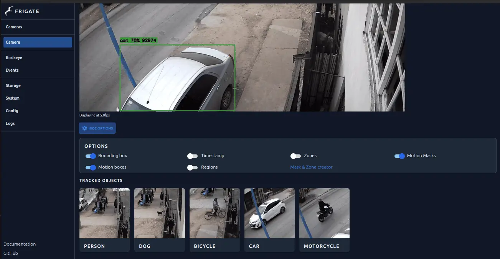

# Project Sentinel: AI-Driven Security Camera System

## Overview
Developed a custom security camera system for a small distributor shop, leveraging an SBC and a TPU for advanced computer vision.

## System Components
- **SBC**: Raspberry Pi 4
- **TPU**: Google Coral
- **Software**: Frigate for real-time object detection
- **Networking**: Twingate for secure remote access

## Implementation Details
The SBC runs the Frigate application, which uses the TPU for efficient object detection. We're currently training and refining detection models, focusing on accuracy with real-time data from the camera.

